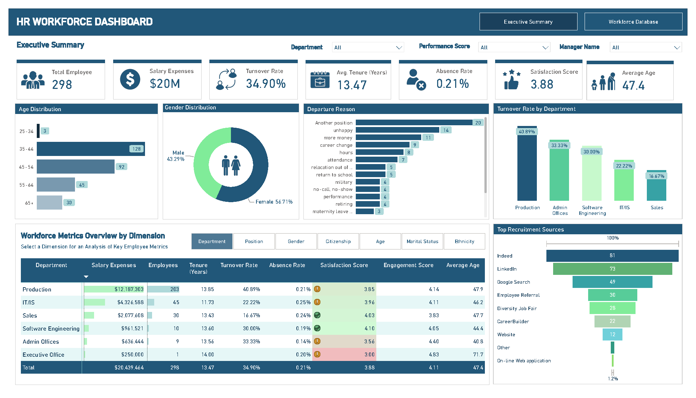
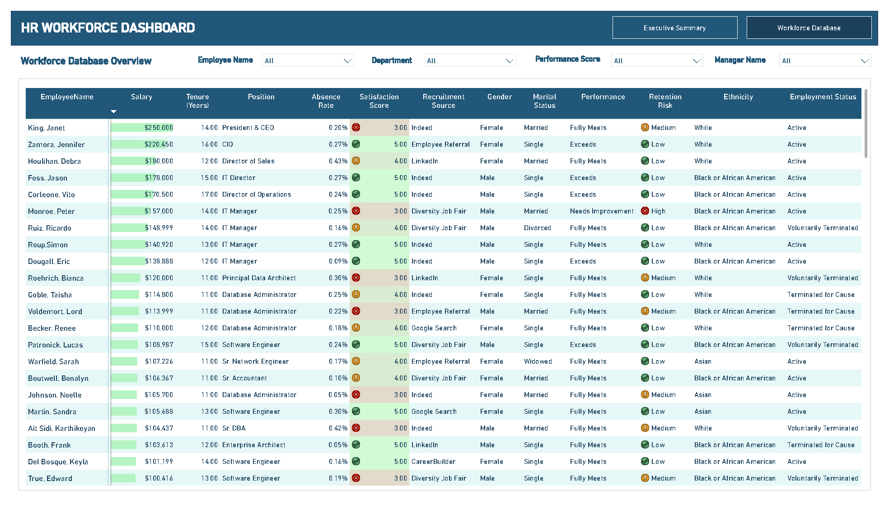

# 📊 HR Workforce Dashboard

## 📌 Project Overview

This project presents an interactive HR analytics dashboard built in Power BI to analyze workforce performance, employee turnover, recruitment effectiveness, and overall workforce metrics.  

The dashboard helps HR teams and management monitor employee-related KPIs and identify workforce trends to support data-driven decision-making.

---

## 🎯 Objectives

- Monitor key HR metrics and workforce performance
- Analyze employee turnover across departments
- Evaluate recruitment source effectiveness
- Track employee satisfaction, engagement, and absence rates
- Support workforce planning and retention analysis

---

## 🛠 Tools & Technologies

- Power BI
- Power Query
- DAX
- Excel

---

## 📷 Dashboard Preview

### Executive Summary

### Workforce Database Overview

---

## 📈 Key Insights

- The overall turnover rate reached **34.9%**, with the Production department showing the highest turnover rate at **40.89%**
- Female employees represented **56.71%** of the workforce
- Indeed and LinkedIn were the most effective recruitment channels
- The average employee tenure was **13.47 years**
- Employee satisfaction and engagement scores remained relatively stable across departments

---

## 📂 Files Included

- `HR_Workforce_Dashboard.pbix` — Power BI dashboard file
- `HR_Workforce_Dashboard.pbix` — Dashboard export version
- Dashboard screenshots
- README documentation

---

## 🚀 Project Features

- Interactive filtering by:
  - Department
  - Performance Score
  - Manager Name
  - Employee Name

- Workforce KPI monitoring
- Recruitment source analysis
- Employee retention risk tracking
- Department-level workforce analysis

---

## 👨‍💻 Author

Nguyen Quang Hung  
